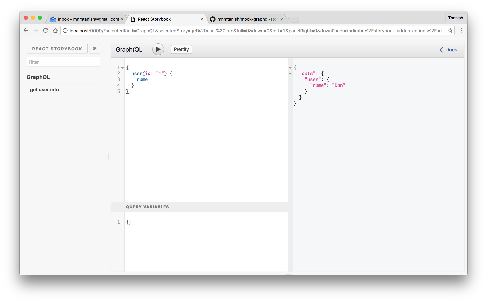

# Storybook Addon Actions

The Action Logger addon can be used to display data received by event handlers. This addon works with both [React Storybook](https://github.com/kadirahq/react-storybook) and [React Native Storybook](https://github.com/kadirahq/react-native-storybook) (included by default).



## Getting Started

You can use this addon without installing it manually.

Import the `action` function and use it to create actions handlers. When creating action handlers, provide a **name** to make it easier to identify.

> *Note: Make sure you do NOT use some reserved words as function names. [issues#29](https://github.com/storybooks/storybook-addon-actions/issues/29#issuecomment-288274794)*

```js
import { storiesOf, action } from '@kadira/storybook'
// or import { action } from '@kadira/storybook-addon-actions'

storiesOf('Button', module)
  .add('default view', () => (
    <Button onClick={ action('button-click') }>
      Hello World!
    </Button>
  ))
```

## Action Decorators

If you wish to process action data before sending them over to the logger, you can do it with action decorators.

`decorateAction` takes an array of decorator functions. Each decorator function is passed an array of arguments, and should return a new arguments array to use. `decorateAction` returns a function that can be used like `action` but will log the modified arguments instead of the original arguments.

```js
import { action, decorateAction } from '@kadira/storybook-addon-actions'

const firstArgAction = decorateAction([
  args => args.slice(0, 1)
]);

storiesOf('Button', module)
  .add('default view', () => (
    <Button onClick={ firstArgAction('button-click') }>
      Hello World!
    </Button>
  ))
```
