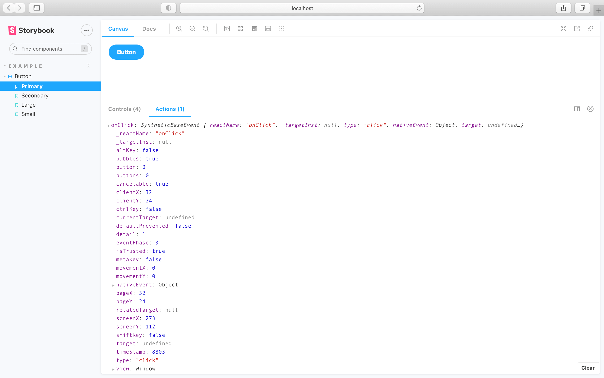

# Storybook Addon Actions

[](https://circleci.com/gh/storybooks/storybook)
[](https://www.codefactor.io/repository/github/storybooks/storybook)
[](https://snyk.io/test/github/storybooks/storybook/8f36abfd6697e58cd76df3526b52e4b9dc894847)
[](https://bettercodehub.com/results/storybooks/storybook) [](https://codecov.io/gh/storybooks/storybook)
[](https://now-examples-slackin-rrirkqohko.now.sh/)
[](#backers) [](#sponsors)

---

Storybook Addon Actions can be used to display data received by event handlers in [Storybook](https://storybook.js.org).

[Framework Support](https://github.com/storybooks/storybook/blob/master/ADDONS_SUPPORT.md)



## Getting Started

Install:

```sh
npm i -D @storybook/addon-actions
```

Then, add following content to `.storybook/addons.js`

```js
import '@storybook/addon-actions/register';
```

Import the `action` function and use it to create actions handlers. When creating action handlers, provide a **name** to make it easier to identify.

> _Note: Make sure NOT to use reserved words as function names. [issues#29](https://github.com/storybooks/storybook-addon-actions/issues/29#issuecomment-288274794)_

```js
import { storiesOf } from '@storybook/react';
import { action } from '@storybook/addon-actions';

import Button from './button';

storiesOf('Button', module).add('default view', () => (
  <Button onClick={action('button-click')}>Hello World!</Button>
));
```

## Multiple actions

If your story requires multiple actions, it may be convenient to use `actions` to create many at once:

```js
import { storiesOf } from '@storybook/react';
import { actions } from '@storybook/addon-actions';

import Button from './button';

const events = actions('onClick', 'onDoubleClick');
storiesOf('Button', module).add('default view', () => <Button {...events}>Hello World!</Button>);
```

## Action Decorators

If you wish to process action data before sending them over to the logger, you can do it with action decorators.

`decorateAction` takes an array of decorator functions. Each decorator function is passed an array of arguments, and should return a new arguments array to use. `decorateAction` returns a function that can be used like `action` but will log the modified arguments instead of the original arguments.

```js
import { decorateAction } from '@storybook/addon-actions';

import Button from './button';

const firstArgAction = decorateAction([args => args.slice(0, 1)]);

storiesOf('Button', module).add('default view', () => (
  <Button onClick={firstArgAction('button-click')}>Hello World!</Button>
));
```
