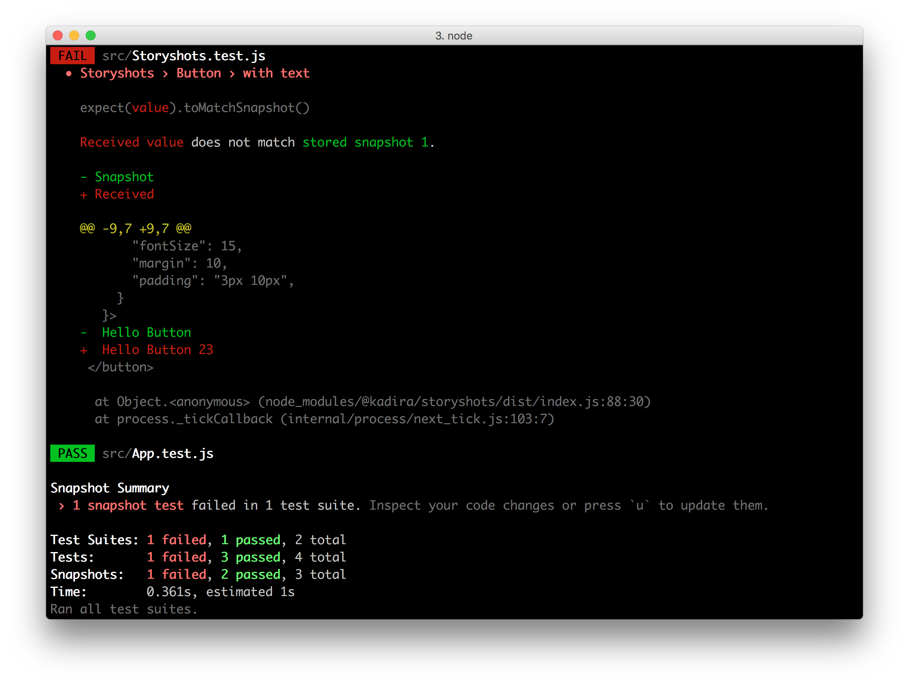

# StoryShots

[](https://circleci.com/gh/storybooks/storybook)
[](https://www.codefactor.io/repository/github/storybooks/storybook)
[](https://snyk.io/test/github/storybooks/storybook/8f36abfd6697e58cd76df3526b52e4b9dc894847)
[](https://bettercodehub.com/results/storybooks/storybook) [](https://codecov.io/gh/storybooks/storybook)  
[](https://now-examples-slackin-rrirkqohko.now.sh/)
[](#backers) [](#sponsors)

* * *

StoryShots adds automatic Jest Snapshot Testing for [Storybook](https://storybook.js.org/).

This addon works with Storybook for:
- [React](https://github.com/storybooks/storybook/tree/master/app/react)
- [React Native](https://github.com/storybooks/storybook/tree/master/app/react-native)



To use StoryShots, you must use your existing Storybook stories as the input for Jest Snapshot Testing.

## Getting Started

Add the following module into your app.

```sh
npm install --save-dev @storybook/addon-storyshots
```

## Configure your app for Jest

Usually, you might already have completed this step. If not, here are some resources for you.

-   If you are using Create React App, it's already configured for Jest. You just need to create a filename with the extension `.test.js`.
-   Otherwise check this Egghead [lesson](https://egghead.io/lessons/javascript-test-javascript-with-jest).

> Note: If you use React 16, you'll need to follow [these additional instructions](https://github.com/facebook/react/issues/9102#issuecomment-283873039).

## Configure Storyshots

Create a new test file with the name `Storyshots.test.js`. (Or whatever the name you prefer, as long as it matches Jest's config [`testMatch`](http://facebook.github.io/jest/docs/en/configuration.html#testmatch-array-string)).
Then add following content to it:

```js
import initStoryshots from '@storybook/addon-storyshots';

initStoryshots();
```

That's all.

Now run your Jest test command. (Usually, `npm test`.) Then you can see all of your stories are converted as Jest snapshot tests.


## Options

### `configPath`

By default, Storyshots assumes the config directory path for your project as below:

-   Storybook for React: `.storybook`
-   Storybook for React Native: `storybook`

If you are using a different config directory path, you could change it like this:

```js
import initStoryshots from '@storybook/addon-storyshots';

initStoryshots({
  configPath: '.my-storybook-config-dir'
});
```

### `suite`

By default, Storyshots groups stories inside a Jest test suite called "Storyshots". You could change it like this:

```js
import initStoryshots from '@storybook/addon-storyshots';

initStoryshots({
  suite: 'MyStoryshots'
});
```

### `storyKindRegex`

If you'd like to only run a subset of the stories for your snapshot tests based on the story's kind:

```js
import initStoryshots from '@storybook/addon-storyshots';

initStoryshots({
  storyKindRegex: /^MyComponent$/
});
```

This can be useful if you want to separate the snapshots in directories next to each component. See an example [here](https://github.com/storybooks/storybook/issues/892).

If you want to run all stories except stories of a specific kind, you can write an inverse regex which is true for all kinds except those with a specific word such as `DontTest`

```js
import initStoryshots from '@storybook/addon-storyshots';

initStoryshots({
  storyKindRegex:/^((?!.*?DontTest).)*$/
});
```

This can be useful while testing react components which make use of the findDomNode API since they always fail with snapshot testing
while using react-test-renderer see [here](https://github.com/facebook/react/issues/8324)

### `storyNameRegex`

If you'd like to only run a subset of the stories for your snapshot tests based on the story's name:

```js
import initStoryshots from '@storybook/addon-storyshots';

initStoryshots({
  storyNameRegex: /buttons/
});
```

### `framework`

If you are running tests from outside of your app's directory, storyshots' detection of which framework you are using may fail. Pass `"react"` or `"react-native"` to short-circuit this.

### `test`

Run a custom test function for each story, rather than the default (a vanilla snapshot test). See the exports section below for more details.

## Exports

Apart from the default export (`initStoryshots`), Storyshots also exports some named test functions (see the `test` option above):

### `snapshot`

The default, render the story as normal and take a Jest snapshot.

### `renderOnly`

Just render the story, don't check the output at all (useful if you just want to ensure it doesn't error).

### `snapshotWithOptions(options)`

Like the default, but allows you to specify a set of options for the test renderer. [See for example here](https://github.com/storybooks/storybook/blob/b915b5439786e0edb17d7f5ab404bba9f7919381/examples/test-cra/src/storyshots.test.js#L14-L16).

### `shallowSnapshot`

Take a snapshot of a shallow-rendered version of the component.
