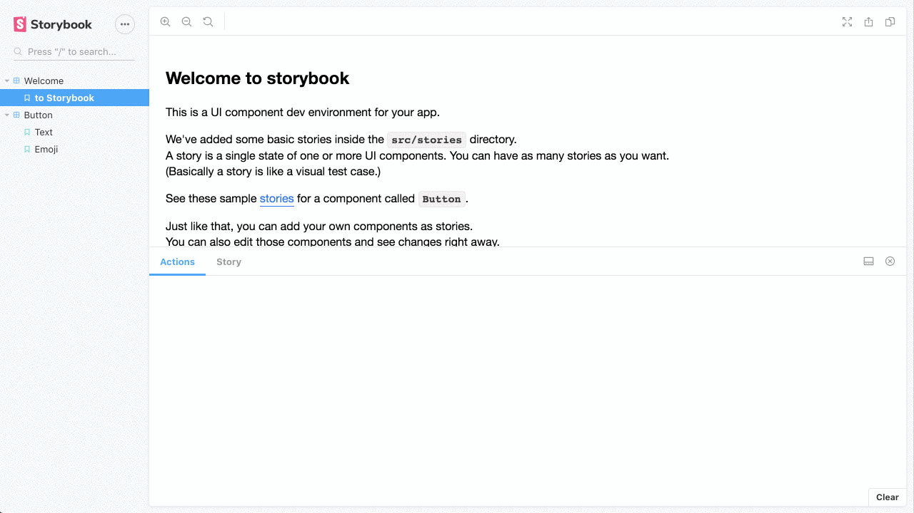

# Storybook Storysource Addon

This addon is used to show stories source in the addon panel.

[Framework Support](https://github.com/storybookjs/storybook/blob/master/ADDONS_SUPPORT.md)



## Getting Started

First, install the addon

```sh
yarn add @storybook/addon-storysource @storybook/source-loader --dev
```

You can add configuration for this addon by using a preset or by using the addon config with webpack

### Install using preset

Add the following to your `.storybook/presets.js` exports:

```js
module.exports = ['@storybook/addon-storysource/preset'];
```

You can pass configurations into the addon-storysource loader in your `.storybook/presets.js` file, e.g.:

```javascript
module.exports = [
  {
    name: '@storybook/addon-storysource/preset',
    options: {
      rule: {
        // test: [/\.stories\.jsx?$/], This is default
        include: [path.resolve(__dirname, '../src')], // You can specify directories
      },
      loaderOptions: {
        prettierConfig: { printWidth: 80, singleQuote: false },
      },
    },
  },
];
```

## Loader Options

The loader can be customized with the following options:

### parser

The parser that will be parsing your code to AST (based on [prettier](https://github.com/prettier/prettier/tree/master/src/language-js))

Allowed values:

- `javascript` - default
- `typescript`
- `flow`

Be sure to update the regex test for the webpack rule if utilizing Typescript files.

Usage:

```js
module.exports = function({ config }) {
  config.module.rules.push({
    test: /\.stories\.tsx?$/,
    loaders: [
      {
        loader: require.resolve('@storybook/source-loader'),
        options: { parser: 'typescript' },
      },
    ],
    enforce: 'pre',
  });

  return config;
};
```

### prettierConfig

The prettier configuration that will be used to format the story source in the addon panel.

Defaults:

```js
{
  printWidth: 100,
  tabWidth: 2,
  bracketSpacing: true,
  trailingComma: 'es5',
  singleQuote: true,
}
```

Usage:

```js
module.exports = function({ config }) {
  config.module.rules.push({
    test: /\.stories\.jsx?$/,
    loaders: [
      {
        loader: require.resolve('@storybook/source-loader'),
        options: {
          prettierConfig: {
            printWidth: 100,
            singleQuote: false,
          },
        },
      },
    ],
    enforce: 'pre',
  });

  return config;
};
```

### uglyCommentsRegex

The array of regex that is used to remove "ugly" comments.

Defaults:

```js
[/^eslint-.*/, /^global.*/];
```

Usage:

```js
module.exports = function({ config }) {
  config.module.rules.push({
    test: /\.stories\.jsx?$/,
    loaders: [
      {
        loader: require.resolve('@storybook/source-loader'),
        options: {
          uglyCommentsRegex: [/^eslint-.*/, /^global.*/],
        },
      },
    ],
    enforce: 'pre',
  });

  return config;
};
```

### injectDecorator

Tell storysource whether you need inject decorator. If false, you need to add the decorator by yourself;

Defaults: true

Usage:

```js
module.exports = function({ config }) {
  config.module.rules.push({
    test: /\.stories\.jsx?$/,
    loaders: [
      {
        loader: require.resolve('@storybook/source-loader'),
        options: { injectDecorator: false },
      },
    ],
    enforce: 'pre',
  });

  return config;
};
```

## Theming

Storysource will automatically use the light or dark syntax theme based on your storybook theme. See [Theming Storybook](https://storybook.js.org/docs/configurations/theming/) for more information.

