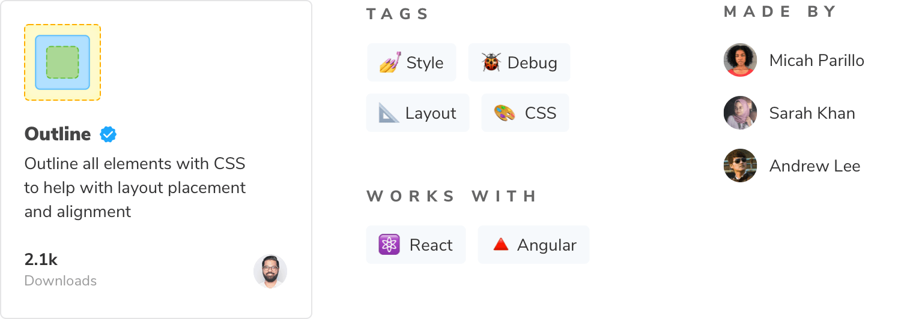

<div class="aside">
The addon catalog is in <strong>beta</strong>. Please report any issues you find.
</div>

Storybook addons are listed in the [catalog](/addons) and distributed via npm. The catalog is populated by querying npm's registry for Storybook-specific metadata in `package.json`.

Add your addon to the catalog by publishing an npm package that follows these requirements:

- `package.json` with [module information](writing-addons.md#get-started) and [addon metadata](#addon-metadata)
- `README.md` file with installation and configuration instructions
- `/dist` directory containing transpiled ES5 code
- `preset.js` file written as an ES5 module at the root level

<div class="aside">

Learn how to write a Storybook addon [here](./writing-addons.md).

</div>

## Addon metadata

We rely on metadata to organize your addon in the catalog. You must add the <code>storybook-addons</code> as the first keyword, followed by your addon's category. Additional keywords will be used in search and as tags.

| Property      | Description                            | Example                                                                   |
| ------------- | -------------------------------------- | ------------------------------------------------------------------------- |
| `name`        | Addon package name                     | storybook-addon-outline                                                   |
| `description` | Addon description                      | Outline all elements with CSS to help with layout placement and alignment |
| `author`      | Name of the author                     | winkerVSbecks                                                             |
| `keywords`    | List of keywords to describe the addon | `["storybook-addons","style","debug"]`                                    |
| `repository`  | Addon repository                       | `{"type": "git","url": "https://github.com/someone/my-addon" }`           |

Customize your addon's appearance by adding the `storybook` property with the following fields.

| Property                | Description                       | Example                               |
| ----------------------- | --------------------------------- | ------------------------------------- |
| `displayName`           | Display name                      | Outline                               |
| `icon`                  | Link to custom icon for the addon | https://yoursite.com/outline-icon.png |
| `unsupportedFrameworks` | List of unsupported frameworks    | Vue                                   |
| `supportedFrameworks`   | List of supported frameworks      | React,Angular                         |

```json
{
  // package.json

  "name": "storybook-addon-outline",
  "version": "1.0.0",
  "description": "Outline all elements with CSS to help with layout placement and alignment",
  "repository": {
    "type": "git",
    "url": "https://github.com/chromaui/storybook-outline"
  },
  "author": "winkerVSbecks",
  "keywords": ["storybook-addons", "style", "debug", "layout", "css"],
  "storybook": {
    "displayName": "Outline",
    "unsupportedFrameworks": ["Vue"],
    "supportedFrameworks": ["React", "Angular"],
    "icon": "https://yoursite.com/outline-icon.png"
  }
}
```

The `package.json` above appears like below in the catalog. See an example of a production package.json [here](https://github.com/chromaui/storybook-outline/blob/main/package.json).



#### How long does it take for my addon to show up in the catalog?

Once you publish the addon, it will appear in the catalog. There may be a delay between the time you publish your addon and when it's listed in the catalog. If your addon doesn't show up within 24 hours, [open an issue](https://github.com/storybookjs/frontpage/issues).
