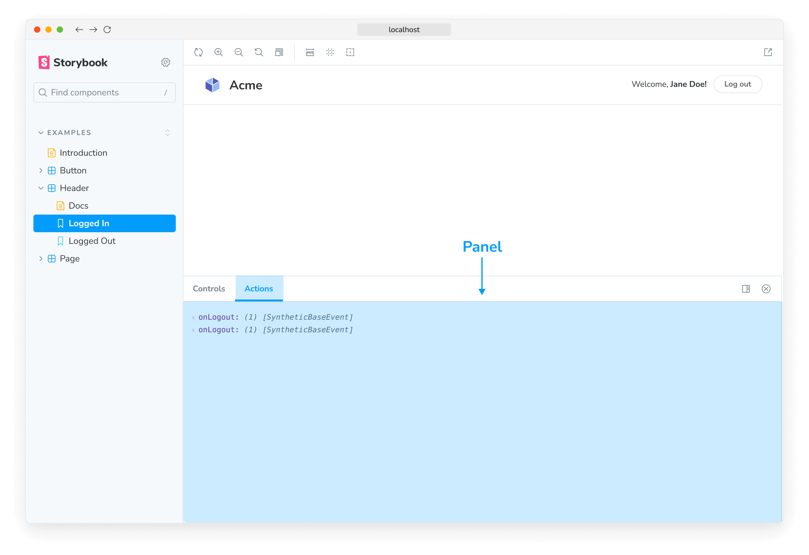
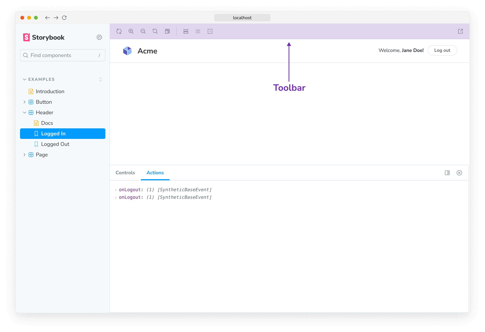
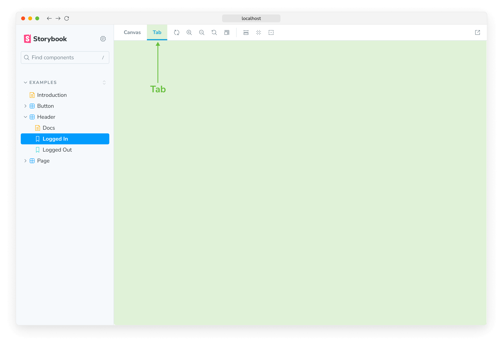

Each Storybook addon is classified into two general categories, UI-based or Presets. Each type of addons feature is documented here. Use this as a reference when creating your addon.

## UI-based addons

UI-based addons allow you to customize Storybook's UI with the following elements.

### Panels

Panel addons allow you to add your own UI in Storybook's addon panel. This is the most common type of addon in the ecosystem. For example, the official [@storybook/actions](../essentials/actions.md) and [@storybook/a11y](https://github.com/storybookjs/storybook/tree/next/code/addons/a11y) use this pattern.

Use this boilerplate code to add a new `Panel` to Storybook's UI:

<!-- prettier-ignore-start -->

<CodeSnippets
  paths={[
    'common/storybook-addon-panel-example.js.mdx',
  ]}
/>

<!-- prettier-ignore-end -->

### Toolbars

Toolbar addons allow you to add your own custom tools in Storybook's Toolbar. For example, the official [@storybook/backgrounds](../essentials/backgrounds.md) and the [@storybook/addon-outline/](../essentials/measure-and-outline.md#outline-addon) use this pattern.

Use this boilerplate code to add a new `button` to Storybook's Toolbar:

<!-- prettier-ignore-start -->

<CodeSnippets
  paths={[
    'common/storybook-addon-toolbar-example.js.mdx',
  ]}
/>

<!-- prettier-ignore-end -->

<Callout variant="info">

The <code>icon</code> element used in the example loads the icons from the <code>@storybook/components</code> package. See [here](../faq.md#what-icons-are-available-for-my-toolbar-or-my-addon) for the list of available icons that you can use.

</Callout>

### Tabs

Tab addons allow you to create your own custom tabs in Storybook. For example, the official [@storybook/addon-docs](../writing-docs/introduction.md) uses this pattern.

Use this boilerplate code to add a new `Tab` to Storybook's UI:

<!-- prettier-ignore-start -->

<CodeSnippets
  paths={[
    'common/storybook-addon-tab-example.js.mdx',
  ]}
/>

<!-- prettier-ignore-end -->

<Callout variant="info">

Learn how to write your own addon that includes these UI elements <a href="./writing-addons">here</a>.

</Callout>

## Preset addons

Storybook preset addons are grouped collections of `babel`, `webpack`, and `addons` configurations to integrate Storybook and other technologies. For example the official [preset-create-react-app](https://github.com/storybookjs/presets/tree/master/packages/preset-create-react-app).

Use this boilerplate code while writing your own preset addon.

<!-- prettier-ignore-start -->

<CodeSnippets
  paths={[
    'common/storybook-preset-full-config-object.js.mdx',
  ]}
/>

<!-- prettier-ignore-end -->

## Learn more about the Storybook addon ecosystem

- Types of addons for other types of addons
- [Writing addons](./writing-addons.md) for the basics of addon development
- [Presets](./writing-presets.md) for preset development
- [Integration catalog](./integration-catalog.md) for requirements and available recipes
- [API reference](./addons-api.md) to learn about the available APIs
