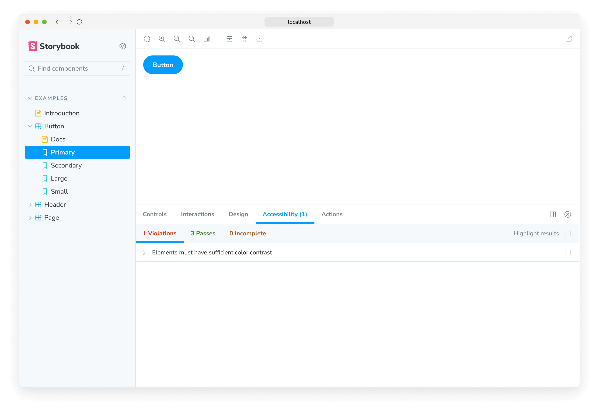

Storybook boasts a wide variety of addons in its ecosystem. All of them packaged as NPM modules and listed in our [addon gallery](/addons). We're going to guide you through the necessary steps to install and register Storybook addons.

### Using addons

With the exception of preset addons, all other follow the same set of installation instructions. Based on a two step process: install and register.

For example, to include accessibility testing in Storybook, run the following command to install the necessary addon:

```shell
yarn add -D @storybook/addon-a11y
```

Next, update [`.storybook/main.js`](../configure/overview.md#configure-story-rendering) to the following:

<!-- prettier-ignore-start -->

<CodeSnippets
  paths={[
    'common/storybook-main-addon-registration.js.mdx',
  ]}
/>

<!-- prettier-ignore-end -->

<div class="aside">
Other addons like the one mentioned might require additional configurations. Check the addon README for additional configuration requirements.
</div>

That's it, when Storybook starts up accessibility testing is enabled.




### Using preset addons 

Storybook preset addons are grouped collections of specific `babel`,`webpack` and `addons` configurations for distinct use cases. Each one with it's own set of instructions. Based on a three step process: install, register and optionally configuration.


For example, to use SCSS styling, run the following command to install the addon and the required dependencies:

```sh
yarn add -D @storybook/preset-scss css-loader sass-loader style-loader
```


Next, update [`.storybook/main.js`](../configure/overview.md#configure-story-rendering) to the following:

<!-- prettier-ignore-start -->

<CodeSnippets
  paths={[
    'common/storybook-main-preset-config.js.mdx',
  ]}
/>

<!-- prettier-ignore-end -->

That's it, when Storybook starts up, it will configure itself to use SCSS styling without any further configuration.


#### Optional configuration

Most preset addons can also take additional parameters. The most common use cases are:

- Addon configuration.
- Webpack loader configuration.

Consider the following example:

<!-- prettier-ignore-start -->

<CodeSnippets
  paths={[
    'common/storybook-preset-configuration.js.mdx',
  ]}
/>

<!-- prettier-ignore-end -->

Now, when Storybook starts up, it will update  webpack's CSS loader to use modules and adjust how styling is defined.

<div class="aside">
Each preset addon has its own options and those should be documented in their README.
</div>
