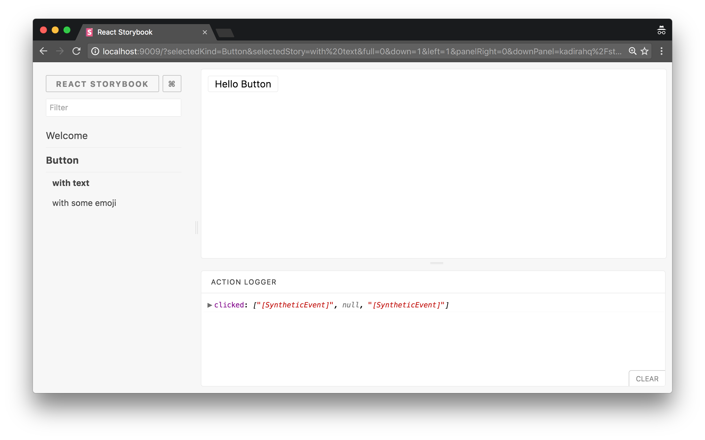
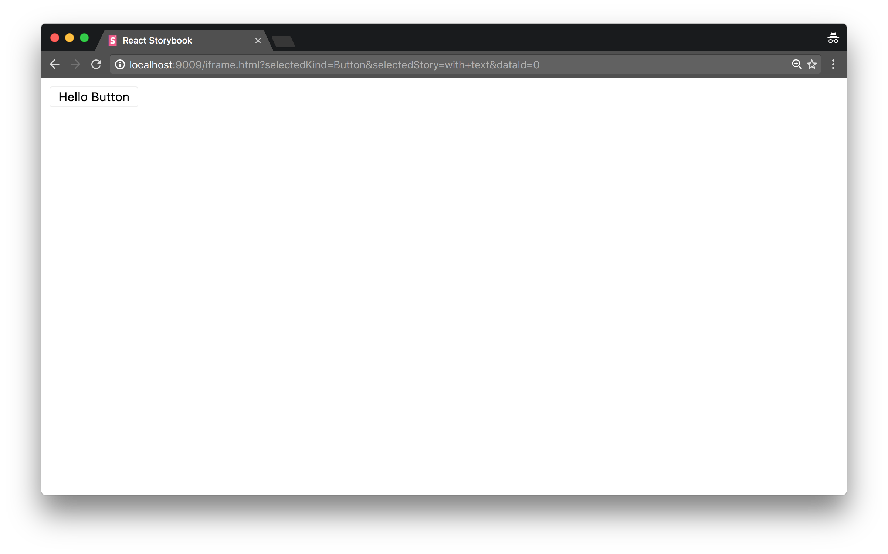

We can also use Storybook as the base for CSS/Style testing with stories as the base. First, have a look at the following Storybook.

In that, you can see the Storybook's manager UI. It has UI elements that are not related to your app. However, there's a way to access just a single story.

For an example, let's assume the above storybook runs on port 9009 and we can access it via [http://localhost:9009](http://localhost:9009/).
Then Let's pick a single story: the "with text" story of the Button. So, in this case:

-   selectedKind = Button
-   selectedStory = with text

Then, we can see the above story using the following URL:

<http://localhost:9009/iframe.html?selectedKind=Button&selectedStory=with+text&dataId=0>

Just like that, you can access all of the stories in your Storybook.

## Supported CSS/Style Testing Frameworks

It will be hard to use all the frameworks we've [mentioned](/testing/react-ui-testing#3-css-style-testing), but we'll be able to use frameworks which are based on URL as the input source. (Such as [BackstopJS](https://github.com/garris/BackstopJS) and [Gemini](https://github.com/gemini-testing/gemini))

> In the future we are also planning to smooth this process with the help of [StoryShots](https://github.com/storybooks/storyshots).
