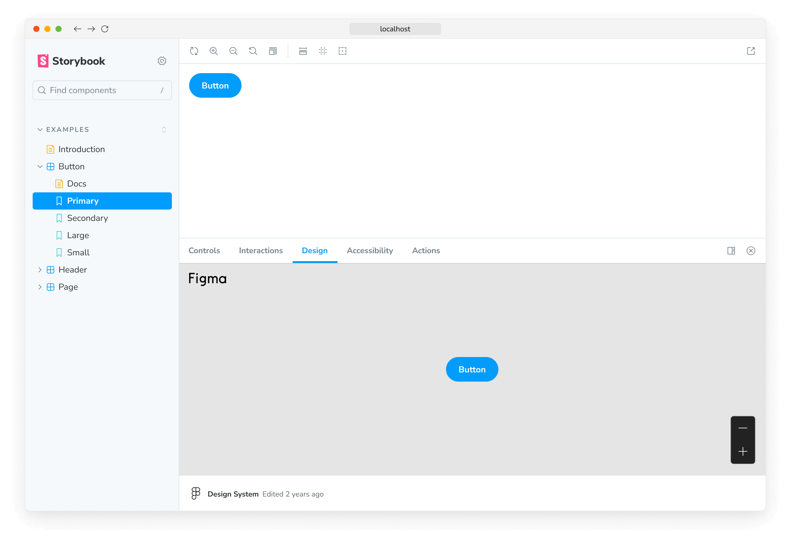
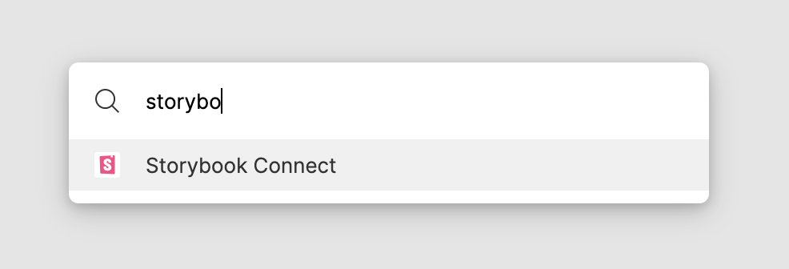

Storybook supports first-class integrations with well-known design tools, speeding up the development cycle by enabling you to cross-reference designs with your existing stories.

For development teams, Storybook provides the necessary tools to build, [test](../writing-tests/introduction.md), and [document](../writing-docs/introduction.md) UI components. [Integrating](https://storybook.js.org/addons/tag/design/) your Storybook with popular design tools (for example, [Figma](https://www.figma.com/), [Zeplin](https://zeplin.io/)) unlocks new workflows for you and your team. You prototype the UI in a design tool, build and test it in Storybook, allowing you to surface issues and ensure consistent and reliable UIs.

## Figma

[Figma](https://www.figma.com/) is a popular collaborative UI design tool used by [Slack](https://slack.com/), [Twitter](https://twitter.com/), and [Dropbox](https://www.dropbox.com/) teams. It allows multiple people to work on the same design simultaneously in the browser.

If you're working with Figma, you have two options for connecting your Storybook. You can use the [Storybook addon designs](https://storybook.js.org/addons/storybook-addon-designs), which allows you to preview your designs alongside the currently selected story.

Or via a plugin developed by the Storybook maintainers. [Storybook Connect](https://www.figma.com/community/plugin/1056265616080331589/Storybook-Connect) is the official Figma plugin that lets you link stories to your Figma components. You can preview your existing stories in the Figma design workspace when configured. Below is an overview of how to get started with the plugin.

### Setup

To use the plugin, you must have a Storybook [published in Chromatic](./publish-storybook.md#publish-storybook-with-chromatic), a free publishing service made for Storybook that documents, versions, and indexes your UI components securely in the cloud. You'll be using the URL of your published Storybook to connect to the plugin.

Navigate to [Storybook Connect](https://www.figma.com/community/plugin/1056265616080331589/Storybook-Connect) to install the plugin. In Figma, open the command palette (in Mac OS, use `Command + /`, in Windows use `Control + /`) and type `Storybook Connect` to enable it.

Follow the instructions to connect and authenticate with Chromatic.

### Link stories to Figma components

The core feature of the [Storybook Connect](https://www.figma.com/community/plugin/1056265616080331589/Storybook-Connect) Figma plugin is the ability to connect your existing components, variants, and instances to Storybook stories.

To link your components with Storybook stories, navigate to the story published on Chromatic, ensure that you're using the correct branch, and copy the link.

In Figma, open the plugin and paste the URL.

Once they're connected, you'll be able to preview the story by clicking the link in the sidebar.

💡 The plugin does not support linking stories to Figma layers.

### Preview stories in Figma

Another essential feature of the plugin is the ability to preview the story directly in your Figma workspace. To preview the story connected to your existing component, open Figma's design sidebar and click the "View story" action.

<video autoPlay muted playsInline loop>
  <source src="figma-plugin-open-story.mp4" type="video/mp4" />
</video>

## Adobe XD

[Adobe XD](https://www.adobe.com/products/xd.html) is a vector-based UI and UX design tool, enabling design teams to create wireframes, interactive designs, prototypes, or hi-fidelity web or application designs.

Adobe XD integrates with Storybook via [addon](https://storybook.js.org/addons/storybook-addon-xd-designs), enabling you to embed your design specs alongside your Storybook stories.

## Zeplin

[Zeplin](https://zeplin.io/) is a design tool that generates styleguides from [Sketch](https://www.sketch.com/), [Figma](https://www.figma.com/), and [Adobe XD](https://www.adobe.com/en/products/xd.html). It generates metadata automatically for items such as assets, colors, or measurements from design files, making it easier for developers to follow the spec. If you're working with Zeplin, you can connect your Storybook in various ways; you can use the new [integration](https://support.zeplin.io/en/articles/5674596-connecting-your-storybook-instance-with-zeplin) or via the [Zeplin Storybook addon](https://storybook.js.org/addons/storybook-zeplin).

The addon displays the design alongside the currently selected story and includes convenient tooling to overlay the static design atop the live component. With the new integration, you get a first-class integration featuring all the existing features provided by the addon, only requiring a [published](./publish-storybook.md) Storybook.

## Zeroheight

[Zeroheight](https://zeroheight.com/) is a collaborative styleguide generator for design systems. It showcases design, code, brand, and copywriting documentation in one place. Users can easily edit that documentation with a WYSIWYG editor.

Zeroheight integrates with [Storybook](https://zeroheight.com/3xlwst8/p/507ba7-storybook), enabling you to embed stories alongside your design specs.

## UXPin

[UXPin](https://www.uxpin.com/) is an interactive design tool that uses production code to generate design flows, allowing seamless collaboration between teams as they use the building blocks: components. If you're working with UXPin, it also [integrates Storybook](https://www.uxpin.com/docs/merge/storybook-integration/), enabling you to connect your design system libraries to Storybook stories.

<video autoPlay muted playsInline loop>
  <source
    src="storybook-uxpin.mp4"
    type="video/mp4"
  />
</video>

## InVision Design System Manager

[Invision DSM](https://www.invisionapp.com/design-system-manager) is a design system documentation tool. It helps design teams consolidate UX principles, user interface design, and design tokens in a shared workspace.

Invision also provides a [Storybook integration](https://support.invisionapp.com/hc/en-us/articles/360028388192-Publishing-Storybook-to-DSM), enabling you to view your Storybook stories in the application alongside the designs.

### Build an integration

Storybook's API enables you to extend and customize your Storybook. You can integrate via addon to customize Storybook's UI and functionalities or export stories to other tools through embedding. Refer to the following documentation for more information:

- [Addon documentation](../addons/introduction.md) in depth documentation for Storybook addons.
- [Create an addon](https://storybook.js.org/tutorials/create-an-addon/) a step-by-step tutorial to create a custom Storybook addon.