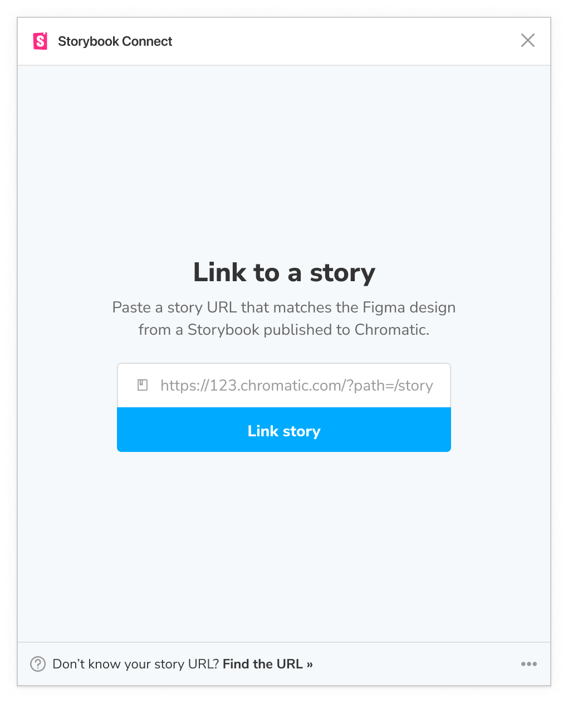
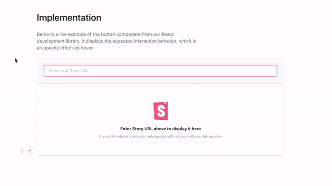

Storybook integrates with design tools to speed up your development workflow. That helps you debug inconsistencies earlier in the design process, discover existing components to reuse, reference designs alongside existing stories.

## Figma

[Figma](https://www.figma.com/) is a collaborative UI design tool that allows multiple people to work on the same design simultaneously in the browser. There are two ways to integrate Storybook and Figma.

- [**Embed Storybook in Figma**](#embed-storybook-in-figma-with-the-plugin)
- [**Embed Figma in Storybook**](#embed-figma-in-storybook-with-the-addon)

### Embed Storybook in Figma with the plugin

[Storybook Connect](https://www.figma.com/community/plugin/1056265616080331589/Storybook-Connect) is a Figma plugin that allows you to embed component stories in Figma. It’s powered by [Storybook embeds](./embed.md) and [Chromatic](https://www.chromatic.com/), a publishing tool created by the Storybook team.

<!-- TODO add image of Figma plugin, take it from the website  -->

#### Install plugin

Before we begin, you must have a Storybook [published to Chromatic](./publish-storybook.md#publish-storybook-with-chromatic). It provides the index, versions, and access control that back the plugin.

Go to [Storybook Connect](https://www.figma.com/community/plugin/1056265616080331589/Storybook-Connect) to install the plugin.

In Figma, open the command palette (in Mac OS, use `Command + /`, in Windows use `Control + /`) and type `Storybook Connect` to enable it.

Follow the instructions to connect and authenticate with Chromatic.

#### Link stories to Figma components

Link stories to Figma components, variants, and instances.

Go to a story in a Storybook published on Chromatic. Make sure it’s on the branch you want to link. Then copy the URL to the story.

In Figma, select the component, open the plugin, and paste the URL.

Chromatic will automatically update your linked stories to reflect the most recent Storybook published on the branch you linked. That means the link persists even as you push new code.

💡 The plugin does not support linking stories to Figma layers.

#### View stories in Figma

Once they're connected, you'll be able to view the story by clicking the link in the sidebar. Click "View story". Alternatively, open the plugin by using the command palette (in Mac OS, use `Command + /`, in Windows use `Control + /`) then type `Storybook Connect`.

<video autoPlay muted playsInline loop>
  <source src="figma-plugin-open-story.mp4" type="video/mp4" />
</video>

### Setup Figma in Storybook with the addon

[Design addon] allows you to embed Figma files and prototypes in Storybook. It’s powered by Figma Live Embeds. You can embed Figma files in Storybook, regardless of the file's sharing settings. Share private files within a team, or public files with the world.
Collaborators can interact with embeds based on their team or Organization permissions.

#### Install design addon

https://storybook.js.org/addons/storybook-addon-designs

#### Link Figma components to stories

Copy the Figma URL

#### TODO

## Adobe XD

[Adobe XD](https://www.adobe.com/products/xd.html) is a vector-based UI and UX design tool, enabling design teams to create wireframes, interactive designs, prototypes, or hi-fidelity web or application designs.

Adobe XD integrates with Storybook via [addon](https://storybook.js.org/addons/storybook-addon-designs/), enabling you to [embed](https://helpx.adobe.com/xd/help/publish-design-specs.html) your design specs alongside your Storybook [stories](https://pocka.github.io/storybook-addon-designs/?path=/story/docs-iframe-readme--page).

## Zeplin

[Zeplin](https://zeplin.io/) is a design tool that generates styleguides from [Sketch](https://www.sketch.com/), [Figma](https://www.figma.com/), and [Adobe XD](https://www.adobe.com/en/products/xd.html). It generates metadata automatically for items such as assets, colors, or measurements from design files, making it easier for developers to follow the spec. If you're working with Zeplin, you can connect your Storybook in various ways; you can use the new [integration](https://support.zeplin.io/en/articles/5674596-connecting-your-storybook-instance-with-zeplin) or via the [Zeplin Storybook addon](https://storybook.js.org/addons/storybook-zeplin).

The addon displays the design alongside the currently selected story and includes convenient tooling to overlay the static design atop the live component. With the new integration, you get a first-class integration featuring all the existing features provided by the addon, only requiring a [published](./publish-storybook.md) Storybook.

## Zeroheight

[Zeroheight](https://zeroheight.com/) is a collaborative styleguide generator for design systems. It showcases design, code, brand, and copywriting documentation in one place. Users can easily edit that documentation with a WYSIWYG editor.

Zeroheight integrates with [Storybook](https://zeroheight.com/3xlwst8/p/507ba7-storybook), enabling you to embed stories alongside your design specs.

## UXPin

[UXPin](https://www.uxpin.com/) is an interactive design tool that uses production code to generate design flows, allowing seamless collaboration between teams as they use the building blocks: components. If you're working with UXPin, it also [integrates Storybook](https://www.uxpin.com/docs/merge/storybook-integration/), enabling you to connect your design system libraries to Storybook stories.

<video autoPlay muted playsInline loop>
  <source
    src="storybook-uxpin.mp4"
    type="video/mp4"
  />
</video>

## InVision Design System Manager

[Invision DSM](https://www.invisionapp.com/design-system-manager) is a design system documentation tool. It helps design teams consolidate UX principles, user interface design, and design tokens in a shared workspace.

Invision also provides a [Storybook integration](https://support.invisionapp.com/hc/en-us/articles/360028388192-Publishing-Storybook-to-DSM), enabling you to view your Storybook stories in the application alongside the designs.

### Build an integration

Storybook's API enables you to extend and customize your Storybook. You can integrate via addon to customize Storybook's UI and functionalities or export stories to other tools through embedding. Refer to the following documentation for more information:

- [Addon documentation](../addons/introduction.md) in depth documentation for Storybook addons.
- [Create an addon](https://storybook.js.org/tutorials/create-an-addon/) a step-by-step tutorial to create a custom Storybook addon.
