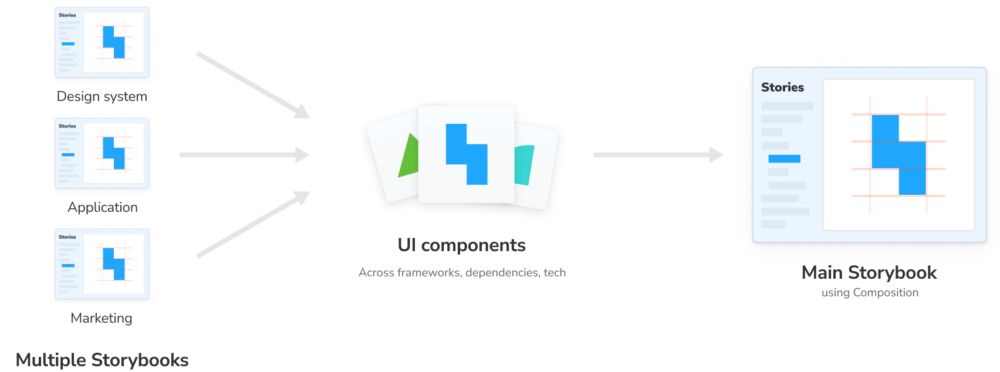

Composition allows you to browse components from any Storybook accessible via URL inside your local Storybook. You can compose any [Storybook published online](./publish-storybook.md) or running locally no matter the view layer, tech stack, or dependencies.


You’ll see the composed Storybook’s stories in the sidebar alongside your own. This unlocks common workflows that teams often struggle with:

- 👩‍💻 UI developers can quickly reference prior art without switching between Storybooks.
- 🎨 Design systems can expand adoption by composing themselves into their users’ Storybooks.
- 🛠 Frontend platform can audit how components are used across projects.
- 📚 View multiple Storybooks with different tech stacks in one place



## Compose published Storybooks

In your [`.storybook/main.js`](../configure/overview.md#configure-story-rendering) file add a `refs` field with information about the reference Storybook. Pass in a URL to a statically built Storybook.

<!-- prettier-ignore-start -->

<CodeSnippets
  paths={[
    'common/storybook-main-ref-remote.js.mdx',
  ]}
/>

<!-- prettier-ignore-end -->

<div class="aside">
 💡 Limitation: Addons in composed Storybooks will not work as they normally do in non-composed Storybook.
</div>

## Compose local Storybooks

You can also compose multiple Storybooks that are running locally. For instance, if you have a React Storybook and a Angular Storybook running on different ports you can update your configuration file (i.e., `.storybook/main.js`) and reference them;

<!-- prettier-ignore-start -->

<CodeSnippets
  paths={[
    'common/storybook-main-ref-local.js.mdx',
  ]}
/>

<!-- prettier-ignore-end -->

Adding this configuration will combine both the React and Angular Storybooks into your current one. When either of these changes, you’ll see the changes being applied automatically. Enabling you to develop both frameworks in sync.

## Compose Storybooks per environment

You can also compose Storybooks based on the current development environment (e.g, development, staging, production). For instance if the project you're working on has already a published Storybook, but also includes a version with cutting edge features not yet released you can adjust the composition based on that. For example:

<!-- prettier-ignore-start -->

<CodeSnippets
  paths={[
    'common/storybook-main-ref-per-environment.js.mdx',
  ]}
/>

<!-- prettier-ignore-end -->

<div class="aside">

💡 Similar to the other fields available in Storybook’s configuration file, the `refs` field can also be a function that accepts a config parameter containing Storybook’s configuration object. Check the [webpack documentation](../builders/webpack.md#extending-storybooks-webpack-config) to learn more about it.

</div>

### Improve your Storybook composition

So far we've seen how we can use composition with local or published Storybooks. One thing worth mentioning as your Storybook will grow in time with your own stories, or through composition with other Storybooks, is that you can optimize the deployment process by including the following command in your workflow, run from your project root:

```shell
npx sb extract
```

<div class="aside">

`sb extract` uses [Puppeteer](https://www.npmjs.com/package/puppeteer), which downloads and installs Chromium. Set the environment `SB_CHROMIUM_PATH` to configure your local Chromium installation.

</div>

Running this command will generate a `stories.json` file in the default build directory (`storybook-static`) with the information related to your Storybook. Here’s an example of the file contents:

<!-- prettier-ignore-start -->

<CodeSnippets
  paths={[
    'common/storybook-extract-result.json.mdx',
  ]}
/>

<!-- prettier-ignore-end -->

Linking to a Storybook deployed using this approach will yield all the stories and other relevant information displayed in the UI.

If you need, you can also add additional arguments to this command. For instance, if you want to generate the stories.json file into a custom directory you can use the following:

```shell
npx sb extract my-built-storybook-directory my-other-directory/stories.json
```

When executed it will lookup a built Storybook in the `my-built-storybook-directory` and create the `stories.json` file in the `my-other-directory` with all the necessary information.

<div class="aside">

💡 If you need to use the arguments, you’ll need to include both of them or the command will fail.

</div>
