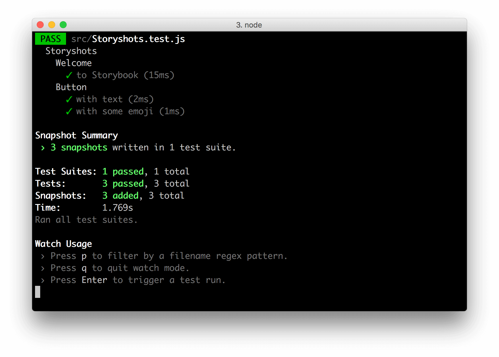
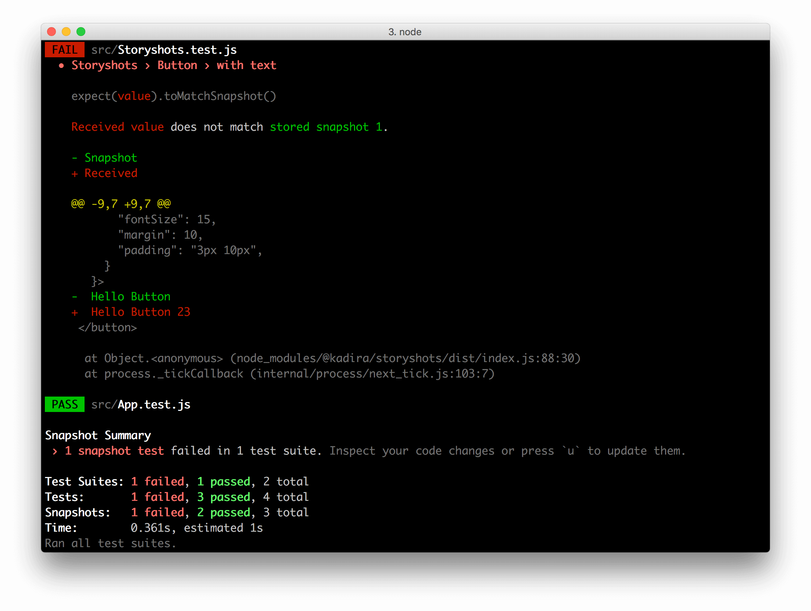

Snapshot tests compare the rendered markup of every story against known baselines. It’s an easy way to identify markup changes that trigger rendering errors and warnings.

Storybook is a convenient tool for snapshot testing because every story is essentially a test specification. Any time you write or update a story you get a snapshot test for free.

Storyshots is an [official addon](https://github.com/storybookjs/storybook/tree/master/addons/storyshots/storyshots-core) that enables snapshot testing. It’s powered by Jest so you’ll need to [install that](https://jestjs.io/docs/en/getting-started) first. Continue on if you already have Jest.

Install the addon. **Make sure** the version of Storyshots and your project’s Storybook version are identical.

```shell
npm i -D @storybook/addon-storyshots
```

Configure Storyshots by adding the following test file to your project:

<!-- prettier-ignore-start -->

<CodeSnippets
  paths={[
    'common/storybook-storyshots-config.js.mdx',
  ]}
/>

<!-- prettier-ignore-end -->

<div class="aside">

You can name the file whatever you like as long as it's picked up by Jest (note that you'll need Jest to be setup already in your project).

</div>

Run your first test. Storyshot will recognize all your CSF files (based on [`.storybook/main.js`](../configure/overview.md#configure-story-rendering)) and produces snapshots.

```shell
npx test storybook.test.js
```

<div class="aside">

If you are loading stories via `.storybook/preview.js` and `require.context()`, you will need to follow some extra steps to ensure Jest finds them. Read more in the [addon documentation](../../addons/storyshots/storyshots-core/README.md#configure-your-app-for-jest/README.md).

</div>

This will create an initial set of snapshots inside your Storybook config directory.



When you make changes to your components or stories, run the test again to identify the changes to the rendered markup.



If the changes are intentional we can accept them as new baselines. If the changes are bugs, fix the underlying code then run the snapshot tests again.

### Configure the snapshot's directory

If the project you're working on has a custom structure for the component's snapshots, you can still continue to use the addon and configure it to suit your needs. You'll need to take some additional steps though.

You'll need to include the `@storybook/addon-storyshots-puppeteer` and `puppeteer` packages into your own environment.

```shell
npm i -D @storybook/addon-storyshots-puppeteer puppeteer
```

Then you'll need to change your `storybook.test.js` file to the following:

<!-- prettier-ignore-start -->

<CodeSnippets
  paths={[
    'common/storybook-storyshots-custom-directory.js.mdx',
  ]}
/>

<!-- prettier-ignore-end -->

<div class="aside">
Don't forget to change the <code>your-custom-directory</code> to the one you're using.
</div>

When you run `npx test storybook.test.js`, your snapshots will be placed in the proper directory.

Storyshots has many other options for advanced use cases such as this one. You can read more about them in the [addon’s documentation](https://github.com/storybookjs/storybook/tree/master/addons/storyshots/storyshots-core).

### Configure the framework
 
By default the [`Storyshots addon`](https://www.npmjs.com/package/@storybook/addon-storyshots) will detect which framework currently being used by your project. If you run into a situation where this is not the case, you can adjust the `config` object and manually specify the framework that you're currently working with. For example if you were working with a Vue 3 project:

<!-- prettier-ignore-start -->

<CodeSnippets
  paths={[
    'common/storybook-storyshots-custom-framework.js.mdx',
  ]}
/>

<!-- prettier-ignore-end -->

Use this table as a reference for manually specifying the framework.

| angular        | html | preact       |
|----------------|------|--------------|
| react          | riot | react-native |
| svelte         | vue  | vue3         |
| web-components | rax  |              |

<div class="aside">

**Snapshot vs visual tests**

[Visual tests](./visual-testing.md) take screenshots of stories and compare them against known baselines. When used to test appearance, visual tests are often a more robust solution than snapshot tests because verifying markup doesn’t test for visual changes.

</div>
