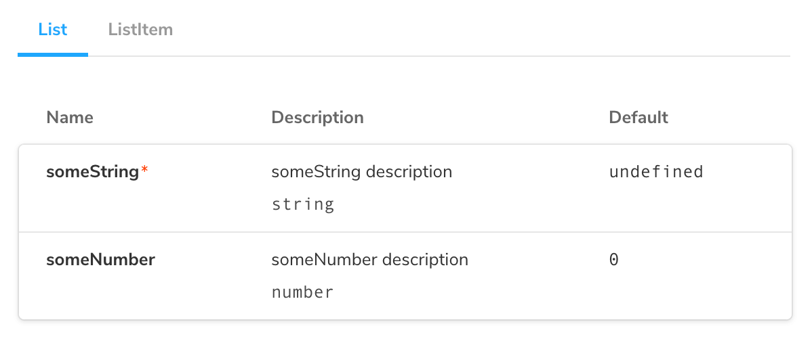

It's useful to write stories that [render two or more components](../writing-stories/introduction.md#stories-for-two-or-more-components) at once if those components are designed to work together. For example, `ButtonGroups`, `Lists`, and `Page` components. Here's an example with `List` and `ListItem` components:

```js
// List.story.js

import List from './List';
import ListItem from './ListItem';

export default {
  component: List,
  subcomponents: [ListItem],
  title: 'List',
};

export const Empty = (args) => <List {...args} />;

export const OneItem = (args) => (
  <List {...args}>
    <ListItem />
  </List>
);
```

Note that by adding `subcomponents` to the default export, we get an extra pane on the ArgsTable, listing the props of `ListItem`:



The downside of the approach used above, where each story creates its own combination of components, is that it does not take advantage of Storybook [Args](../writing-stories/args.md) meaning:

1. You cannot change the stories via the controls panel
2. There is no [args reuse](../writing-stories/introduction.md#using-args) possible, which makes the stories harder to maintain.

Let's talk about some techniques you can use to mitigate the above, which are especially useful in more complicated situations.

## Reusing subcomponent stories

The simplest change we can make to the above is to reuse the stories of the `ListItem` in the `List`:

```js
// List.story.js

import List from './List';
// Instead of importing the ListItem, we import its stories
import { Unchecked } from './ListItem.stories';

export const OneItem = (args) => (
  <List {...args}>
    <Unchecked {...Unchecked.args} />
  </List>
);
```

By rendering the `Unchecked` story with its args, we are able to reuse the input data from the `ListItem` stories in the `List`.

However, we still aren’t using args to control the `ListItem` stories, which means we cannot change them with controls and we cannot reuse them in other, more complex component stories.

## Using children as an arg

One way we improve that situation is by pulling the rendered subcomponent out into a `children` arg:

```js
// List.story.js

const Template = (args) => <List {...args} />;

export const OneItem = Template.bind({});
OneItem.args = {
  children: <Unchecked {...Unchecked.args} />,
};
```

Now that `children` is an arg, we can potentially reuse it in another story.

<div class="aside"/>
As things stand (we hope to improve this soon) you cannot edit children in a control yet.
</div>

## Creating a Template Component

Another option that is more “data”-based is to create a special “story-generating” template component:

```js
// List.story.js

import React from 'react';
import List from './List';
import ListItem from './ListItem';
import { Unchecked } from './ListItem.stories';

const ListTemplate = ({ items, ...args }) => (
  <List>
    {items.map((item) => (
      <ListItem {...item} />
    ))}
  </List>
);

export const Empty = ListTemplate.bind({});
Empty.args = { items: [] };

export const OneItem = ListTemplate.bind({});
OneItem.args = { items: [Unchecked.args] };
```

This approach is a little more complex to setup, but it means you can more easily reuse the `args` to each story in a composite component. It also means that you can alter the args to the component with the Controls addon:

<video autoPlay muted playsInline loop>
  <source
    src="template-component-with-controls-optimized.mp4"
    type="video/mp4"
  />
</video>
