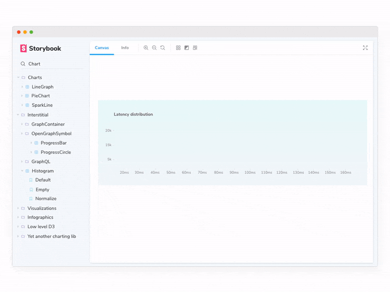

Storybook is a development tool that helps you build components in isolation and record their states as stories. Stories make it easy to explore a component in all its permutations no matter how complex. They also serve as excellent visual test cases.

A story records a way your component can be used. That means your complete set of stories is a catalogue of all the important use cases to test in your component.

The simplest testing method is manual. [Publish](./publish-storybook) your Storybook or run it locally, then look at every story to verify its appearance and behavior. This is appropriate for smaller Storybooks. 

As you add more stories, manual testing becomes infeasible. We recommend automating testing to catch bugs and regressions. A complete Storybook testing strategy combines the following techniques to balance coverage, accuracy, and maintainability:

- Manual tests rely on developers to manually look at a component to verify it for correctness. They help us sanity check a component’s appearance as we build.
- [Unit tests](./unit-testing) verify that the output of a component remains the same given a fixed input. They’re great for testing the functional qualities of a component.
- [Visual regression tests](./visual-testing) capturing screenshots of every story and comparing them against known baselines. They’re great for catching UI appearance bugs. 
- [Interaction tests](./interaction-testing) will render a story and then interact with it in the browser, asserting things about the way it renders and changes.
- [Snapshot tests](./snapshot-testing) compare the rendered markup of every story against known baselines. This catches markup changes that cause rendering errors and warnings.
