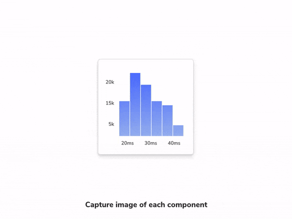

Visual tests, also called visual regression tests, catch bugs in UI appearance. They work by taking screenshots of every story and comparing them commit-to-commit to identify changes. 

This is ideal for verifying what the user sees:

- 🖼️ Layout. 
- 🎨 Color. 
- 📐 Size. 
- 🔳 Contrast.

Storybook is a fantastic tool for visual testing because every story is essentially a test specification. Any time you write or update a story you get a spec for free.

> Visual vs snapshot tests. Snapshot tests compare the rendered markup of every story against known baselines. When used to test how things look, snapshot tests generate a lot of false positives because code changes don’t always yield visual changes.

There are [many tools](https://github.com/mojoaxel/awesome-regression-testing) for visual testing. Storybook uses [Chromatic](https://www.chromatic.com), a visual testing service made by Storybook maintainers to run tests in the cloud across browsers. 

This prevents UI bugs in our:

- 🖥️ [Application](https://www.chromatic.com/library?appId=5a375b97f4b14f0020b0cda3).
- ⚙️ [Design system](https://www.chromatic.com/library?appId=5ccbc373887ca40020446347)
- 🔗 [Website](https://www.chromatic.com/library?appId=5be26744d2f6250024a9117d).

We also maintain [StoryShots](https://github.com/storybookjs/storybook/tree/master/addons/storyshots), a snapshot testing addon that integrates with [jest-image-snapshot](https://github.com/storybookjs/storybook/tree/master/addons/storyshots#configure-storyshots-for-image-snapshots). 
