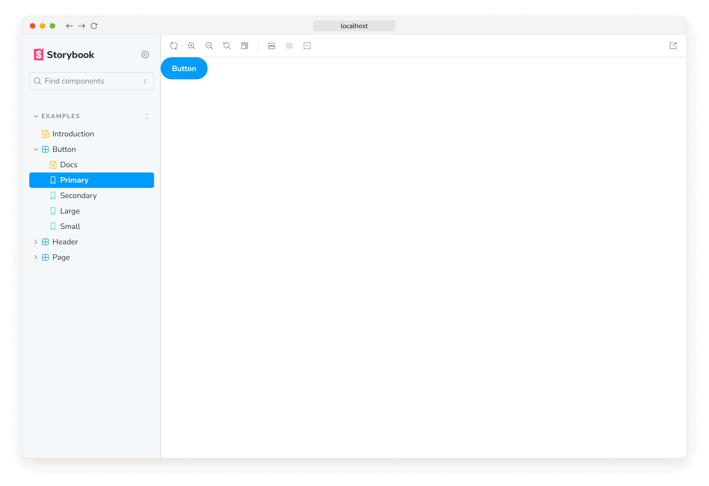

A decorator is a way to wrap a story in extra “rendering” functionality. Many addons define decorators to augment your stories with extra rendering or gather details about how your story renders.

When writing stories, decorators are typically used to wrap stories with extra markup or context mocking.

## Wrap stories with extra markup

Some components require a “harness” to render in a useful way. For instance, if a component runs right up to its edges, you might want to space it inside Storybook. Use a decorator to add spacing for all stories of the component.

<!-- prettier-ignore-start -->

<CodeSnippets
  paths={[
    'react/your-component-with-decorator.js.mdx',
    'react/your-component-with-decorator.story-function-js.js.mdx',
    'react/your-component-with-decorator.ts.mdx',
    'react/your-component-with-decorator.story-function-ts.ts.mdx',
    'vue/your-component-with-decorator.js.mdx',
    'vue/your-component-with-decorator.ts-2.ts.mdx',
    'vue/your-component-with-decorator.ts-3.ts.mdx',
    'angular/your-component-with-decorator.ts.mdx',
    'web-components/your-component-with-decorator.js.mdx',
    'web-components/your-component-with-decorator.ts.mdx',
    'svelte/your-component-with-decorator.js.mdx',
    'solid/your-component-with-decorator.js.mdx',
    'solid/your-component-with-decorator.story-function-js.js.mdx',
    'solid/your-component-with-decorator.ts.mdx',
    'solid/your-component-with-decorator.story-function-ts.ts.mdx',
  ]}
/>

<!-- prettier-ignore-end -->

## “Context” for mocking

Framework-specific libraries (e.g., [Styled Components](https://styled-components.com/), [Fontawesome](https://github.com/FortAwesome/vue-fontawesome) for Vue, Angular's [localize](https://angular.io/api/localize)) may require additional configuration to render correctly in Storybook.

For example, if you're working with React's Styled Components and your components use themes, add a single global decorator to [`.storybook/preview.js`](../configure/overview.md#configure-story-rendering) to enable them. With Vue, extend Storybook's application and register your library. Or with Angular, add the package into your `polyfills.ts` and import it:

<!-- prettier-ignore-start -->

<CodeSnippets
  paths={[
    'react/storybook-preview-with-styled-components-decorator.js.mdx',
    'react/storybook-preview-with-styled-components-decorator.story-function.js.mdx',
    'vue/storybook-preview-with-library-decorator.2-library.js.mdx',
    'vue/storybook-preview-with-library-decorator.3-library.js.mdx',
    'vue/storybook-preview-with-hoc-component-decorator.2-component.js.mdx',
    'vue/storybook-preview-with-hoc-component-decorator.3-component.js.mdx',
    'vue/storybook-preview-with-mixin-decorator.2-mixin.js.mdx',
    'angular/add-localize-package-to-polyfills.ts.mdx',
    'angular/storybook-preview-with-angular-polyfills.js.mdx',
    'solid/storybook-preview-with-styled-components-decorator.js.mdx',
    'solid/storybook-preview-with-styled-components-decorator.story-function.js.mdx',
  ]}
/>

<!-- prettier-ignore-end -->

In the example above, the values provided are hardcoded. Still, you may want to vary them, either per-story basis (i.e., if the values you're adding are relevant to a specific story) or in a user-controlled way (e.g., provide a theme switcher or a different set of icons).

The second argument to a decorator function is the **story context** which in particular contains the keys:

- `args` - the story arguments. You can use some [`args`](./args.md) in your decorators and drop them in the story implementation itself.
- `argTypes`- Storybook's [argTypes](../api/argtypes.md) allow you to customize and fine-tune your stories [`args`](./args.md).
- `globals` - Storybook-wide [globals](../essentials/toolbars-and-globals.md#globals). In particular you can use the [toolbars feature](../essentials/toolbars-and-globals.md#global-types-toolbar-annotations) to allow you to change these values using Storybook’s UI.
- `hooks` - Storybook's API hooks (e.g., useArgs).
- `parameters`- the story's static metadata, most commonly used to control Storybook's behavior of features and addons.
- `viewMode`- Storybook's current active window (e.g., canvas, docs).

💡 This pattern can also be applied to your own stories. Some of Storybook's supported frameworks already use it (e.g., vue 2).

### Using decorators to provide data

If your components are “connected” and require side-loaded data to render, you can use decorators to provide that data in a mocked way without having to refactor your components to take that data as an arg. There are several techniques to achieve this. Depending on exactly how you are loading that data -- read more in the [building pages in Storybook](./build-pages-with-storybook.md) section.

## Story decorators

To define a decorator for a single story, use the `decorators` key on a named export:

<!-- prettier-ignore-start -->

<CodeSnippets
  paths={[
    'react/button-story-decorator.js.mdx',
    'react/button-story-decorator.story-function.js.mdx',
    'react/button-story-decorator.ts.mdx',
    'vue/button-story-decorator.js.mdx',
    'vue/button-story-decorator.ts-2.ts.mdx',
    'vue/button-story-decorator.ts-3.ts.mdx',
    'angular/button-story-decorator.ts.mdx',
    'web-components/button-story-decorator.js.mdx',
    'web-components/button-story-decorator.ts.mdx',
    'svelte/button-story-decorator.js.mdx',
    'solid/button-story-decorator.js.mdx',
    'solid/button-story-decorator.story-function.js.mdx',
    'solid/button-story-decorator.ts.mdx',
  ]}
  usesCsf3
  csf2Path="writing-stories/decorators#snippet-button-story-decorator"
/>

<!-- prettier-ignore-end -->

It is useful to ensure that the story remains a “pure” rendering of the component under test, and any extra HTML or components don't pollute that. In particular the [Source](../writing-docs/doc-block-source.md) Doc Block works best when you do this.

## Component decorators

To define a decorator for all stories of a component, use the `decorators` key of the default CSF export:

<!-- prettier-ignore-start -->

<CodeSnippets
  paths={[
    'react/button-story-component-decorator.js.mdx',
    'react/button-story-component-decorator.ts.mdx',
    'vue/button-story-component-decorator.js.mdx',
    'vue/button-story-component-decorator.ts-2.ts.mdx',
    'vue/button-story-component-decorator.ts-3.ts.mdx',
    'angular/button-story-component-decorator.ts.mdx',
    'web-components/button-story-component-decorator.js.mdx',
    'web-components/button-story-component-decorator.ts.mdx',
    'svelte/button-story-component-decorator.js.mdx',
    'solid/button-story-component-decorator.js.mdx',
    'solid/button-story-component-decorator.ts.mdx',
  ]}
/>

<!-- prettier-ignore-end -->

## Global decorators

We can also set a decorator for **all stories** via the `decorators` export of your [`.storybook/preview.js`](../configure/overview.md#configure-story-rendering) file (this is the file where you configure all stories):

<!-- prettier-ignore-start -->

<CodeSnippets
  paths={[
    'react/storybook-preview-global-decorator.js.mdx',
    'react/storybook-preview-global-decorator.story-function.js.mdx',
    'vue/storybook-preview-global-decorator.js.mdx',
    'angular/storybook-preview-global-decorator.ts.mdx',
    'web-components/storybook-preview-global-decorator.js.mdx',
    'svelte/storybook-preview-global-decorator.js.mdx',
    'solid/storybook-preview-global-decorator.js.mdx',
    'solid/storybook-preview-global-decorator.story-function.js.mdx',
  ]}
/>

<!-- prettier-ignore-end -->

## Decorator inheritance

Like parameters, decorators can be defined globally, at the component level, and for a single story (as we’ve seen).

All decorators relevant to a story will run in the following order once the story renders:

- Global decorators, in the order they are defined
- Component decorators, in the order they are defined
- Story decorators, in the order they are defined
