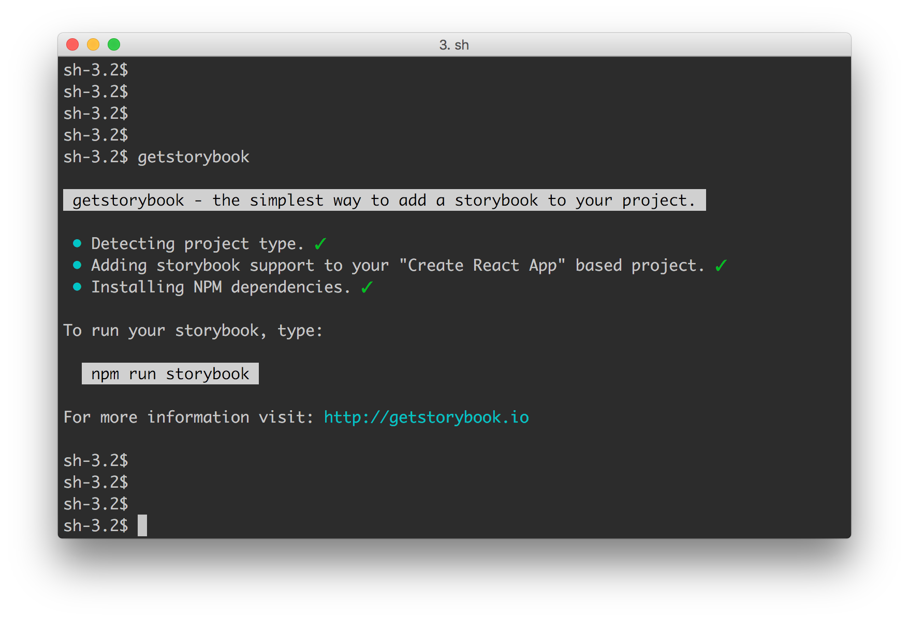

# Storybook CLI

[](https://greenkeeper.io/)
[](https://travis-ci.org/storybooks/storybook)
[](https://www.codefactor.io/repository/github/storybooks/storybook)
[](https://snyk.io/test/github/storybooks/storybook/8f36abfd6697e58cd76df3526b52e4b9dc894847)
[](https://bettercodehub.com/results/storybooks/storybook) [](https://codecov.io/gh/storybooks/storybook)
[](https://storybooks-slackin.herokuapp.com/)

Storybook CLI is the easiest way to add [Storybook](https://github.com/storybooks/storybook) to your project.

In the future it will also add other useful generators and migration tooling.



First install the storybook CLI globally.

```sh
npm i -g @storybook/cli
```

Then go to your project run:

```sh
getstorybook
```

That's all you've to do.

* * *

## [Yarn](https://github.com/yarnpkg/yarn) support

It also supports yarn.
If you have installed yarn in your system, it'll detect it and use `yarn` instead of `npm`.

If you don't want to use `yarn` always you can use the `--use-npm` option like this:

```sh
getstorybook --use-npm
```

For more information visit: [storybook.js.org](https://storybook.js.org)
